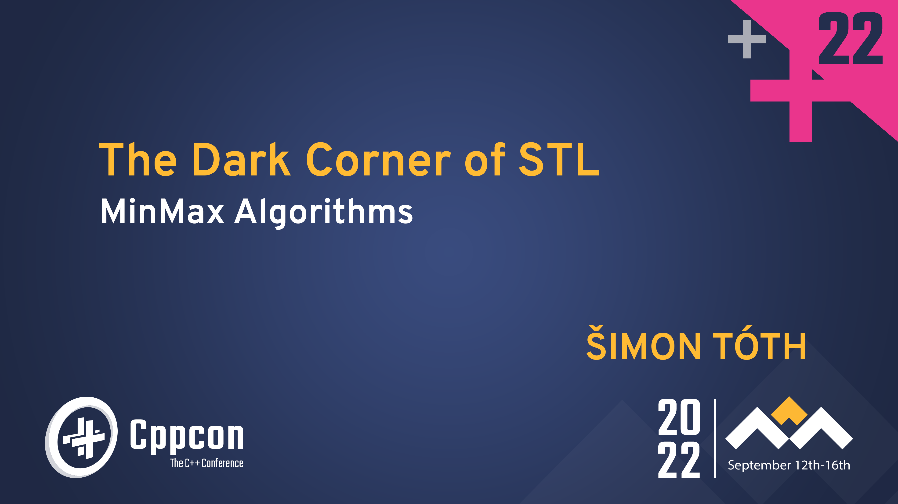

# The Dark Corner of STL: MinMax Algorithms

This repository contains the slides for the CppCon22 talk.
The Dark Corner of STL: MinMax Algorithms.

[Get the Slides PDF](https://github.com/HappyCerberus/cppcon22-talk/blob/main/cppcon22_talk.pdf)

## References & Links

- [Demo of `std::minmax` with `-fsanitize=address`](https://godbolt.org/z/5Tv3zfTPP)
- [Temporary object lifetime](https://en.cppreference.com/w/cpp/language/lifetime#Temporary_object_lifetime)
- [`auto` type deduction](https://en.cppreference.com/w/cpp/language/template_argument_deduction#auto_type_deduction)
- [`std::initializer_list`](https://en.cppreference.com/w/cpp/utility/initializer_list)
- [`const_cast`](https://en.cppreference.com/w/cpp/language/const_cast)
- [`std::common_reference`](https://en.cppreference.com/w/cpp/types/common_reference)
- [`requires` clause](https://en.cppreference.com/w/cpp/language/constraints#Requires_clauses)
- [`std::is_same`](https://en.cppreference.com/w/cpp/types/is_same)
- [All combinations for `std::common_reference_t`](https://godbolt.org/z/1vGxe4Yqr)
- [brute-force "solution"](https://godbolt.org/z/ejvKx8YEh)
- [C++20 "solution"](https://godbolt.org/z/6qdGvczz3)
- [variadric version of min](https://godbolt.org/z/8x8sPYG4v)

## Contacts

If you have questions, feel free ask through any of the following contact options (my DMs are open):

- [Twitter](https://twitter.com/SimonToth83)
- [LinkedIn](https://cz.linkedin.com/in/simontoth)
- [Email](business@simontoth.eu)

## Get my free book

